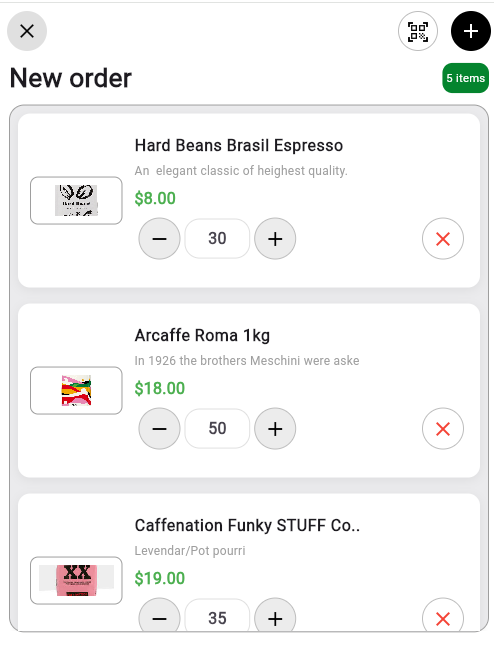
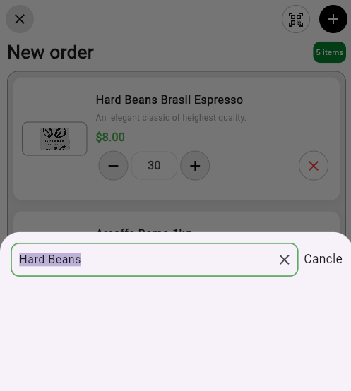
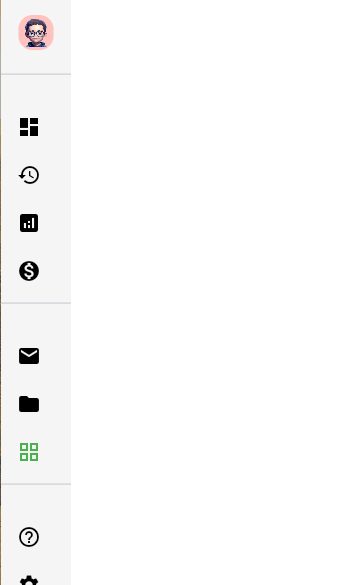
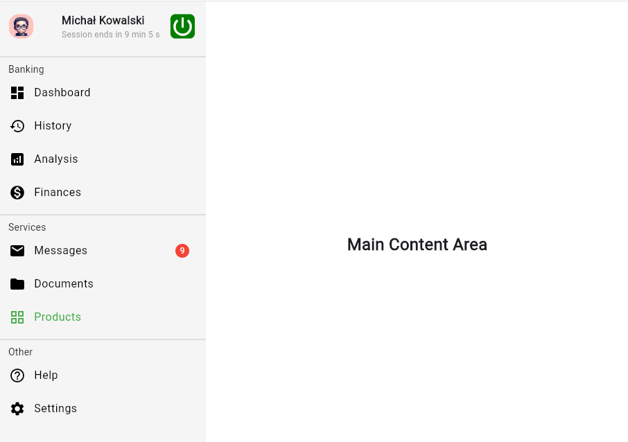

# cart_page and side nav bar

A new Flutter project.

## screenshots and vedios of cart page

### screen record
https://github.com/user-attachments/assets/04748041-f709-4187-afca-1cf786b35ebf

## Screen shots and vedios of side nav bar

### screen record
https://github.com/user-attachments/assets/30892926-ee7e-4c81-a629-21a9c890646c

## Getting Started

This project is a starting point for a Flutter application.

A few resources to get you started if this is your first Flutter project:

- [Lab: Write your first Flutter app](https://docs.flutter.dev/get-started/codelab)
- [Cookbook: Useful Flutter samples](https://docs.flutter.dev/cookbook)

For help getting started with Flutter development, view the
[online documentation](https://docs.flutter.dev/), which offers tutorials,
samples, guidance on mobile development, and a full API reference.
